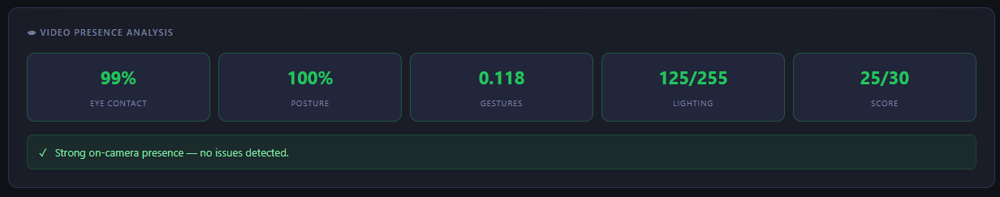
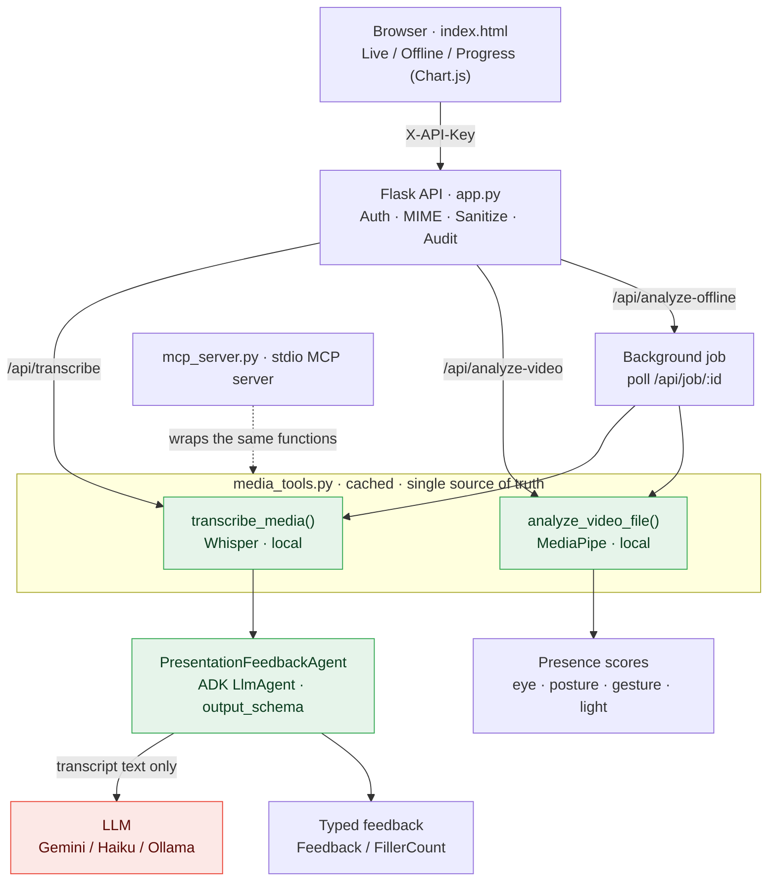
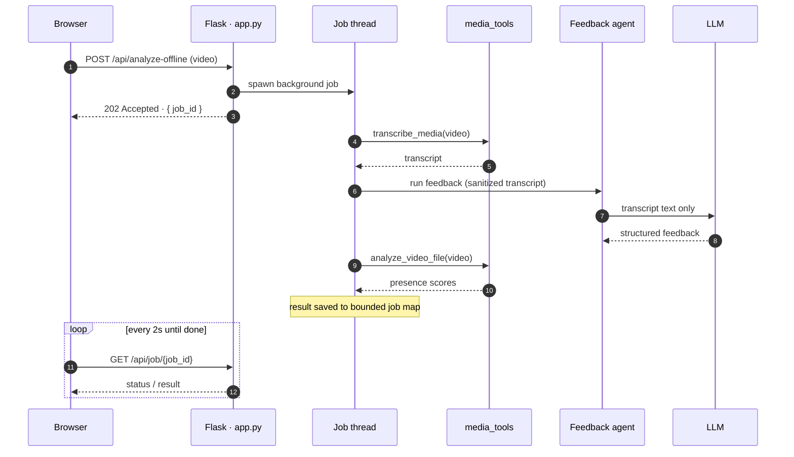

# 🎤 Presentation Coach Agent

> Real-time AI-powered speech and video feedback for presentation rehearsal — built with MCP, Google ADK, agent skills, and production security features.




**Presentation Coach** is a **local-first AI agent** that gives you structured, real-time feedback while you rehearse — on pacing, filler words, tone, slide relevance, and on-camera presence. Your audio and video never leave your machine; only the transcript **text** is sent to the LLM you pick (Gemini, Claude Haiku, or a local Ollama model). It was built as a course capstone around four agent concepts: a custom **MCP server**, an **ADK feedback agent** with typed output, **agent skills**, and a **7-pillar security** model.

---

## Table of Contents

- [Quick Start](#quick-start)
- [The Story Behind This Project](#the-story-behind-this-project)
- [Problem](#problem) · [Solution](#solution) · [Features](#features)
- [LLM Providers](#llm-providers)
- [Architecture](#architecture)
- [Tech Stack](#tech-stack)
- [Setup — Local](#setup--local)
- [API Reference](#api-reference)
- [Security (7 Pillars)](#security--the-7-pillar-agent-security-architecture-day-4)
- [Key Concepts](#key-concepts)
- [Environment Variables](#environment-variables)
- [Troubleshooting](#troubleshooting)
- [Acknowledgments](#acknowledgments) · [License](#license)

---

## Quick Start

```bash
# 1. Install dependencies
pip install -r requirements.txt
```

```powershell
# 2. Pick a provider + key, then start the API (dev mode skips auth)
$env:MODEL_PROVIDER="gemini"; $env:GOOGLE_API_KEY="your-key"; $env:FLASK_ENV="development"
python app.py                 # → http://127.0.0.1:5001
```

```bash
# 3. In a second terminal, serve the UI
python -m http.server 8080    # → open http://localhost:8080
```

Open the UI, click **Start Rehearsal**, and speak. Switch to **Offline Analysis** to score a recorded video, or **Progress** to see your trends.

---

## The story behind this project

In June 2026, I defended my master's thesis in data science. Months of work compressed into a single presentation in front of a jury. I had practiced, of course, but practicing alone in front of a mirror only gets you so far. You cannot see yourself the way your audience does. You cannot count your filler words. You cannot tell whether your eye contact is reassuring or anxious.

In the days before my defense, I began looking for tools that could provide that kind of feedback. It was also the week I was attending the 5-Day AI Agents: Intensive Vibe Coding Course with Google (June 15–19, 2026). There I was, learning to build AI agents, yet the tools that could help me prepare my own presentation were either locked behind a subscription or required me to upload my video to a third-party server.

I decided to build this instead as my Capstone Project. Audio and video are processed locally. Only the transcript text is sent to the LLM of your choice.

---

## Problem

Most people rehearse presentations silently or with a friend who gives vague feedback. There is no fast, structured way to know whether you are speaking too fast, using too many filler words, drifting off-topic, or sounding hesitant — while it is happening.

Hiring a coach is expensive. Recording yourself and reviewing it later is slow. What was missing was an agent that sits in the room with you during rehearsal and gives structured, actionable feedback in real time.

---

## Solution

**Presentation Coach Agent** is an AI agent that:

1. Records your speech as you rehearse slide by slide
2. Transcribes it locally using **Whisper** (faster-whisper, no cloud STT)
3. Sends the transcript to an **ADK LLM feedback agent** for analysis
4. Returns **typed, schema-validated feedback** (an ADK `output_schema` object) on pacing, filler-word counts, tone, and slide relevance
5. Analyses uploaded video using **MediaPipe** locally for eye contact, posture, gestures, and lighting
6. Visualises your session in a **Chart.js dashboard** — filler counts, a presence radar, and eye-contact / score trends — fed by `/api/history`
7. Logs every agent action to an audit trail

Audio and video never leave your machine. Only the transcript text goes to the LLM.

---

## Features

- 🎙 **Live rehearsal coaching** — record slide by slide, get feedback in seconds
- 🧠 **Typed LLM feedback** — pacing, filler-word counts, tone, slide relevance (ADK `output_schema`)
- 👁 **Local video presence** — eye contact, posture, gestures, lighting via MediaPipe
- 📊 **Progress dashboard** — Chart.js trends built from your session history
- 🔌 **Custom MCP server** — Whisper + MediaPipe exposed as stdio tools
- 🔒 **Local-first & secured** — media stays on-device; API-key auth, input sanitization, audit log
- 🔁 **Swap LLM providers** — Gemini, Claude Haiku, or local Ollama via one env var

---

## LLM Providers

The system supports three providers, switchable via a single environment variable:

| Provider | Speed | Privacy | When to use |
|----------|-------|---------|-------------|
| **Gemini** (default) | Fast (~2s) | Transcript sent to Google | Default — free tier, 1,500 req/day |
| **Claude Haiku** | Fast (~2s) | Transcript sent to Anthropic | Gemini quota exhausted |
| **Ollama (local)** | Slow on CPU (~130s), fast on GPU | Fully local | Kaggle GPU / machines with GPU |

```powershell
# Gemini (default)
$env:MODEL_PROVIDER="gemini"; $env:GOOGLE_API_KEY="your-key"

# Claude Haiku fallback
$env:MODEL_PROVIDER="anthropic"; $env:ANTHROPIC_API_KEY="your-key"

# Local Ollama (GPU recommended)
$env:MODEL_PROVIDER="ollama"; $env:OLLAMA_MODEL="gemma4:e2b-it-qat";
```

---

## Architecture




> 🟢 green = runs locally (audio/video never leaves your machine) · 🔴 red = the only hop off-device (transcript **text** to the LLM)

Transcription and video analysis are **deterministic** — no model is needed to decide
to run Whisper or MediaPipe — so on the hot path, they are plain in-process calls into
`media_tools.py`, with the models loaded **once per process** (not reloaded per request).
`mcp_server.py` wraps the *same* `media_tools` functions and exposes them over stdio, so
the tools are reachable by any MCP client from a single source of truth. Only the feedback
step uses an LLM, and it returns a typed `output_schema` object.

(An earlier iteration wrapped each deterministic step in its own `LlmAgent`; on the local CPU
those routing round-trips dominated the latency, so they were removed — one model call per
analysis instead of five.)

### Request lifecycle — offline mode

The offline endpoint returns immediately with a `job_id`; the heavy work runs on a background thread while the browser polls for the result.



### Performance & reliability

- **Whisper model cached per process** — loaded once, not rebuilt on every request.
- **Better transcription, zero extra CPU** — `condition_on_previous_text=False` stops silence-hallucination loops, the current slide's text is passed as Whisper's `initial_prompt` to bias vocabulary, and VAD is tuned. Set `WHISPER_MODEL=base.en` for stronger English at the same cost.
- **Structured output** — the feedback agent uses an ADK `output_schema` (`Feedback` / `FillerCount`), replacing brittle free-text JSON parsing.
- **Bounded job store** — the offline-job map evicts the oldest entries, so it can't grow without limit.
- **Provider-aware health** — `/api/health` reports the active provider instead of always probing Ollama; timestamps are timezone-aware UTC.

### Agent Skills (`.agents/skills/`)

```
.agents/skills/
  ├── audio-transcription/SKILL.md
  ├── presentation-feedback/
  │     ├── SKILL.md
  │     └── references/rubric.md
  └── slide-tracking/SKILL.md
```

---

## Project Structure

```
presentation-coach/
├── app.py                  # Flask API — auth, validation, audit log, ADK runner
├── adk_agents.py           # ADK feedback agent (output_schema) + in-process media calls
├── media_tools.py          # Shared, cached Whisper + MediaPipe (single source of truth)
├── mcp_server.py           # MCP server — same two tools over stdio (imports media_tools)
├── index.html              # Browser UI — Live / Offline / Progress (Chart.js) tabs
├── AGENTS.md               # Agent DNA — read automatically by AI coding agents
├── requirements.txt        # Python dependencies
├── Dockerfile
├── docker-compose.yml
└── .agents/skills/
```

---

## Tech Stack

| Layer | Technology |
|-------|-----------|
| Agent framework | Google ADK (`google-adk`) + LiteLLM |
| Tool protocol | MCP (`mcp`) over stdio |
| Speech-to-text | faster-whisper (local) |
| Video analysis | MediaPipe + OpenCV |
| Backend | Flask + Flask-CORS · gunicorn (production) |
| Frontend | Vanilla JS + Chart.js |
| LLMs | Gemini 2.5 Flash · Claude Haiku · Ollama |
| Language / runtime | Python 3.11+ |

Exact pinned versions are in [`requirements.txt`](requirements.txt).

---

## Setup — Local

### Prerequisites

- Python 3.11+
- API key for at least one LLM provider (Google AI, Anthropic, or local Ollama)
- A microphone

### 1. Install dependencies

```bash
pip install -r requirements.txt
```

### 2. Configure environment

```env
# Choose one provider:
MODEL_PROVIDER=gemini          # or anthropic, or ollama
GOOGLE_API_KEY=...             # if using gemini
ANTHROPIC_API_KEY=...          # if using anthropic
OLLAMA_MODEL=qwen2.5:3b        # if using ollama (ollama must be running)

# Flask
API_KEY=dev-key-change-in-production
AUDIT_LOG=audit.jsonl
FLASK_ENV=development          # skips API key auth in dev
```

### 3. Start the Flask server

```powershell
$env:MODEL_PROVIDER="gemini"; $env:GOOGLE_API_KEY="your-key"; $env:FLASK_ENV="development"
python app.py
# Runs at http://127.0.0.1:5001
```

### 4. Open the UI

```bash
python -m http.server 8080
# Open http://localhost:8080
```

---

## API Reference

All endpoints except `/api/health` require the `X-API-Key` header (which is bypassed in dev mode).

| Method | Endpoint | Description |
|--------|----------|-------------|
| `POST` | `/api/transcribe` | Audio → transcript + structured feedback |
| `POST` | `/api/analyze-video` | Video → presence scores |
| `POST` | `/api/analyze-offline` | Video → background job (transcript + feedback + presence) |
| `GET` | `/api/job/<job_id>` | Poll an offline job's status / result |
| `POST` | `/api/upload-slides` | PDF/PPTX → per-slide text for relevance analysis |
| `POST` | `/api/slide` | Update current slide number |
| `GET` | `/api/history` | Session history (also feeds the Progress dashboard) |
| `GET` | `/api/health` | Health check (reports the active provider) |

---

## Security — the 7-Pillar Agent Security Architecture (Day 4)

All seven pillars from the Day 4 baseline are addressed:

| Pillar | Implementation |
|--------|---------------|
| 1 — Infrastructure & Networking | CORS locked to `localhost` only; server binds `127.0.0.1` |
| 2 — Data | Raw audio/video never leave the machine; only local transcript text reaches the LLM; temp files deleted per request |
| 3 — Model | `sanitize_transcript` strips prompt-injection patterns and caps length **inside the pipeline, before the feedback agent sees the transcript** — not merely at the display layer |
| 4 — Application & Runtime | MIME validation before bytes touch disk; `MAX_TRANSCRIPT_CHARS` bound; per-request temp-file cleanup |
| 5 — Identity & Access (IAM) | `X-API-Key` via `secrets.compare_digest`; dev bypass via `FLASK_ENV` |
| 6 — Observability & Security Ops | Structured JSON logging with request IDs, latency, and auth-failure events |
| 7 — Governance | Every tool call appended to an immutable `audit.jsonl` trail |

---

## Key Concepts

| Concept | Where |
|---------|-------|
| **ADK LLM Agent** | `adk_agents.py` — `PresentationFeedbackAgent` with `output_schema` returns typed feedback |
| **MCP Server** | `mcp_server.py` — Whisper + MediaPipe exposed over stdio; shares its implementation with the in-process hot path via `media_tools.py` |
| **Data Visualisation** | `index.html` — Chart.js Progress dashboard fed by `/api/history` |
| **Agent Skills** | `.agents/skills/` — SKILL.md files |
| **Security (7 Pillars)** | `app.py` |
| **Spec-Driven Dev (Day 5)** | `references/rubric.md` (spec) + `tests/golden_test.py` (AI-generated test coverage); `Dockerfile` + `docker-compose.yml` (deployment) |
| **Agentic Dev** | `AGENTS.md` |

---

## Environment Variables

| Variable | Default | Description |
|----------|---------|-------------|
| `MODEL_PROVIDER` | `gemini` | `gemini` / `anthropic` / `ollama` |
| `GOOGLE_API_KEY` | — | Required if `MODEL_PROVIDER=gemini` |
| `GEMINI_MODEL` | `gemini-2.5-flash` | Gemini model name (1.5-flash retired) |
| `ANTHROPIC_API_KEY` | — | Required if `MODEL_PROVIDER=anthropic` |
| `OLLAMA_MODEL` | `qwen2.5:3b` | Ollama model name |
| `OLLAMA_URL` | `http://localhost:11434` | Ollama server URL |
| `API_KEY` | `dev-key-change-in-production` | Flask API key |
| `FLASK_ENV` | `production` | Set to `development` to skip auth |
| `AUDIT_LOG` | `audit.jsonl` | Audit log path |

---

## Troubleshooting

**`ModuleNotFoundError: No module named 'pkg_resources'`** — upgrade setuptools: `pip install --upgrade setuptools`

**NumPy 2.x conflict with numba/whisper** — pin numpy: `pip install "numpy<2"`

**`module aiohttp has no attribute ClientConnectorDNSError`** — already patched in `app.py` via compatibility shim; if you see this, ensure you're running the latest `app.py`

**Gemini 429 quota exhausted** — switch provider: `$env:MODEL_PROVIDER="anthropic"`

**Ollama slow on CPU (~130s/request)** — expected without a GPU; increase patience or switch to Gemini/Haiku

**Port 5000 in use** — app runs on 5001 by default; update `index.html` `API_URL` if you change it

---

## Contributing

This is a course capstone, but issues and suggestions are welcome — open an issue or PR.

---

## Acknowledgments

Built as the capstone for the **5-Day AI Agents Intensive (Vibe Coding) course with Google** (June 2026). Stands on [Google ADK](https://google.github.io/adk-docs/), the [Model Context Protocol](https://modelcontextprotocol.io/), [faster-whisper](https://github.com/SYSTRAN/faster-whisper), and [MediaPipe](https://developers.google.com/mediapipe).

---

## License

MIT — see [`LICENSE`](LICENSE) for details.
